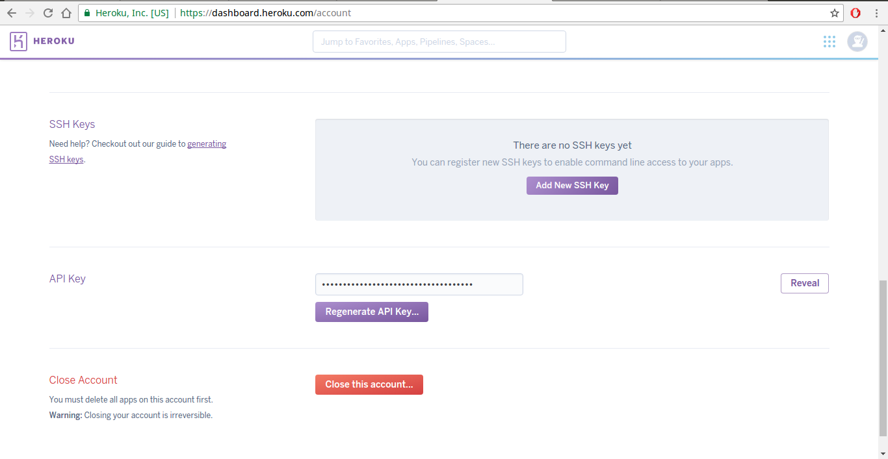
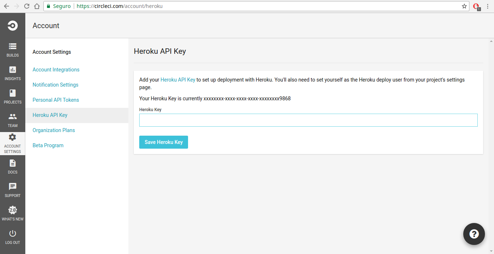
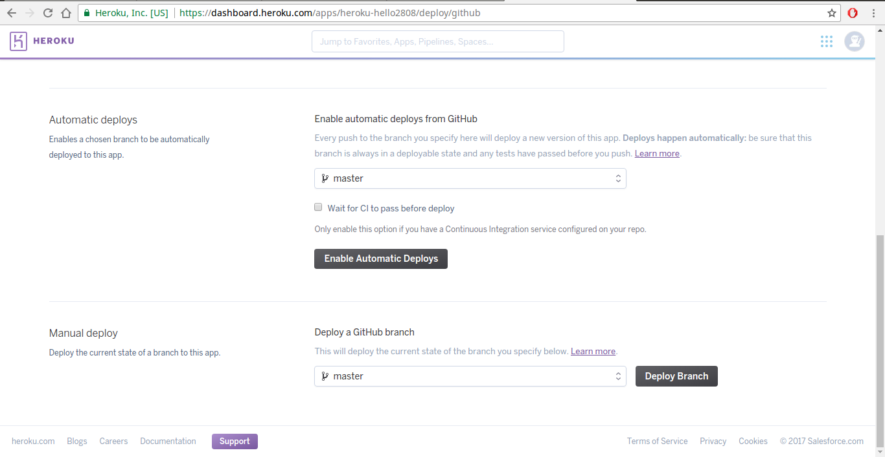
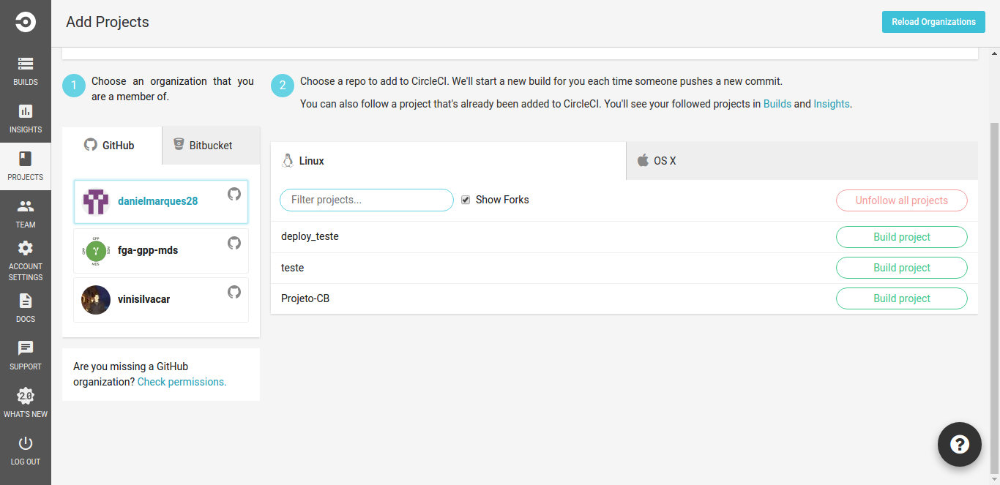

## Tutorial

1. Se cadastre (ou faça login se já tiver uma conta) no site da ferramenta de deploy Heroku https://www.heroku.com/home.

2. Nas configurações da sua conta no Heroku (https://dashboard.heroku.com/account), vá até o topico “API Key”, clique no botão “Reveal” e copiei o campo de chave ao lado do botão.

3. Se cadastre (ou faça login se já tiver uma conta) no site da ferramenta de integração contínua CircleCI https://circleci.com/.

4. Nas configurações da sua conta (“Accounts Settings”) no CircleCI em Heroku API Key (https://circleci.com/account/heroku), cole a sua chave do Heroku e clique em “Save Heroku Key”.

5. Instale o aplicativo Heroku em seu Linux. Para Ubuntu e derivados basta adicionar o repo e instalar:

        $ sudo apt-get install software-properties-common # debian only

        $ sudo add-apt-repository "deb https://cli-assets.heroku.com/branches/stable/apt ./"

        $ curl -L https://cli-assets.heroku.com/apt/release.key | sudo apt-key add -

        $ sudo apt-get update

        $ sudo apt-get install heroku

6. Faça login no heroku do seu pc com o comando:

        $ heroku login

7. Criei um app no heroku:

        $ heroku apps:create <nome_do_app_no_heroku_aqui>

8. No site heroku vá até a dashboard de apps (https://dashboard.heroku.com/apps/), clique no app que foi criado no terminal.

9. Clique na aba “Deploy”, selecione a ferramenta de versionamento como GitHub em “Deployment method”, selecione o repositório desejado em “App connected to GitHub”.

10. Ative o deploy contínuo de uma determinada branch do seu repositorio em “Automatic deploys”, ative a checkbox “Wait for CI to pass before deploy” e clique no botão “Enable Automatic Deploys”.

11. Crie um arquivo na pasta do seu projeto chamado “circle.yml” com algum editor de texto, em seguida coloque dentro desse arquivo as configurações:

        deployment:

        staging:

        branch: master

        heroku:

          appname: <nome_do_seu_app_no_heroku_aqui>

12. Configure o arquivo “circle.yml” com os dados do seu projeto, adicione outras configurações e scripts se quiser.

13. No CircleCI na opção lateral “Projects” clique no botão “Add Project” (https://circleci.com/add-projects/gh/:org) e selecione seu repositório do GitHub que será feito a integração contínua e clique no botão ao lado “Build Project”.

14. Caso seu projeto use SSH, nas configurações do projeto vá no tópico “Permissions” e clique em “Checkout SSH Keys” e adicione a deploy key e a user key. Ainda no mesmo tópico clique em “SSH Permissions” e adicione a SSH key do seu repositório.

15. Pronto ! Ao commitar na branch escolhida para deploy haverá as mudanças automaticamente inseridas no Heroku.
