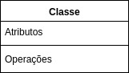
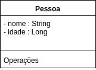
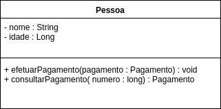
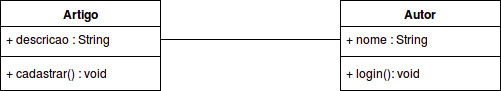
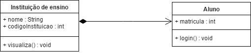
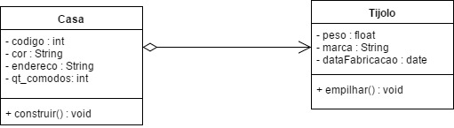
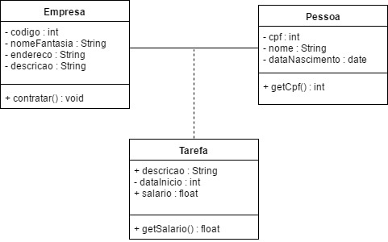
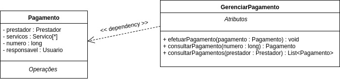
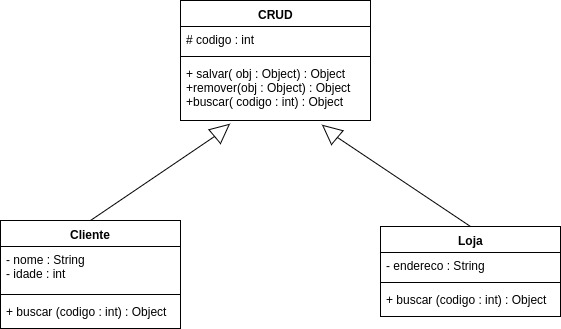
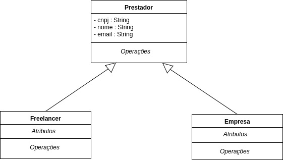

# Introdução

Em um projeto de software bem conceituado e estruturado tanto na documentação quanto na implementação, é necessário sua representação em alguma forma, normalmente tendo a opção de um diagrama.

Porém, antes de entrarmos no conceito de Diagrama de classe, é necessário entender o que é UML (<i>Unified Modeling Language</i> - Linguagem de Modelagem Unificada).

UML pode ser definida como: “uma família  de notações gráficas, apoiada por um metamodelo único, que ajuda na descrição e no projeto de sistemas de software, particularmente daqueles construídos utilizando  o estilo  orientado a objetos”. Usá-la torna o projeto mais <b>visível</b> e <b>inteligível</b> utilizando diagramas e documentos, sendo comumente utilizado para que todos consigam entender o projeto mesmo com ele possuindo uma grande complexidade.

# O que é um Diagrama de Classes?

Um diagrama de classes é uma representação estrutural e relacional das classes que servem de modelo para objetos, ou seja, é um diagrama que tem o intuito de mostrar estruturas e relacionamentos entre representações de objetos do mundo real, ligados em um contexto como o de um projeto de software, sendo considerada uma modelagem muito útil para o desenvolvimento de sistemas, pois define todas as classes que o sistema necessita possuir, tendo como utilidade definir todas as classes que o sistema necessita possuir e, mais especificamente, sua relação com as outras, inferindo métodos e atributos.

<h3><b> Exemplo: </b></h3>

Para a construção de um bom Diagrama de Classes, tem-se a necessidade de, além de compreender completamente o projeto ao qual está trabalhando, conhecer como é representada graficamente cada componente do diagrama de classe, como as classes em si e os relacionamentos.

Para uma classe ser representada graficamente no diagrama, é necessário que ela tenhas a seguinte estrutura:

Porém, antes de construir a classe tem-se a necessidade de haver um conhecimento prévio sobre o significado de cada componente desta, a fim de facilitar a construção correta do diagrama. Após ser cumprido esses requisitos, temos a necessidade de conhecer como cada componente é representado visualmente na classe.

### Visibilidade

A visibilidade define se o atributo ou o método vai ser público, privado, protegido ou em pacote, havendo uma representação definida para cada tipo:

* (+)  para atributos ou métodos públicos;
* (-)  para atributos ou métodos privados;
* (#)  para atributos ou métodos protegidos;
* (~)  para atributos ou métodos em pacote.

### Atributo

Para a representação de um atributo em uma classe, deve-se seguir a seguinte estrutura:

visibilidade nome : tipo[multiplicidade] = valor inicial {propriedades} (caso necessário)

<h3><b> Exemplo: </b></h3>

### Operação

Para a representação de uma operação (método) em uma classe, deve-se seguir a seguinte estrutura:

visibilidade nome(parâmetros) : tipo de retorno {propriedades}

Para seus parâmetros, também há uma representação correta de sua formação, sendo:

nome : tipo[multiplicidade]

<h3><b> Exemplo: </b></h3>

# O que é necessário ter em um bom Diagrama de Classes?

Existem três perspectivas, cada um para um observador diferente. Ou seja, para o seu diagrama explicar o seu projeto da melhor forma, vai depender de para quem ele será apresentado.

## Três perspectivas básicas para a construção de um Diagrama de Classes

A primeira das três perspectivas de um Diagrama de Classes é a Conceitual: com uma perspectiva destinada ao cliente, que não necessariamente precisa saber quais métodos e atributos você vai utilizar na construção do projeto, ela representa os conceitos do domínio em estudo, ou seja, que você entendeu como vai funcionar o seu projeto e como as suas classes estão se relacionando entre si e que está apto a aumentar o nível de abstração a nível de código. Ele funciona como um “resumo” do seu diagrama final.

Uma vez moldado um Diagrama de Classes na perspectiva Conceitual, o próximo passo é a perspectiva de Especificação, que tem como foco as principais interfaces da arquitetura, nos principais métodos, e não como eles irão ser implementados. Em outras palavras, você vai explicar como o seu projeto funcionará internamente para as pessoas envolvidas no projeto, mas que não fazem parte do time de desenvolvimento, tais como gerentes de projeto.

Por fim, o último e mais utilizado é a perspectiva de Implementação, onde aborda completamente o seu projeto, especificando quais atributos, seus tipos e quais métodos pertencem a cada classe e tem foco principal no time de desenvolvimento. Ele irá guiar a forma como o seu código será escrito e o funcionamento do seu produto final.

## O que colocar e não colocar em um Diagrama de Classes?

Conforme especificado, cada nível de abstração em um diagrama necessita de mais informação. Em resumo, um nível de abstração maior necessita de mais detalhes.

Então, um diagrama sob uma perspectiva de Implementação necessita de atributos e seus tipos, os métodos destes, além do tipo de relacionamento entre as classes. Por outro lado, um diagrama sob uma visão de Especificação necessita de menos detalhes, sendo necessário apenas na arquitetura e principais métodos, diferente de uma perspectiva Conceitual onde apenas necessita que você explicite as classes e o tipo de relacionamento entre elas.

Enfim, evite adicionar informação desnecessária dependendo do público a qual ele é destinado mas também nunca esqueça de adicionar informações cruciais conforme a perspectiva do seu diagrama.

# Relacionamento entre classes

O relacionamento entre classes dentro de um diagrama de classes é de suma importância para definir os tipos de dependência e para representar características de um projeto em geral, pois, a partir da análise dessas informações, tem-se o melhor entendimento do projeto como um todo. Com isso, existem alguns tipos de relações que são utilizadas para fazer relacionamentos entre classes, que serão apresentadas as seguir.

## Associação simples

A associação simples entre as classes de um projeto é o tipo de ligação entre as mesmas utilizado nos diagramas de classe, a finalidade da mesma é só mostrar como fica a dependência entre as classes ou relacionamento de uma classe com a outra.

Esse tipo de associação de classe não é nada mais que uma linha preenchida que conecta uma classe a outra que está sendo referenciada, quando o cliente ou o desenvolvedor observa essa imagem já faz ou pode fazer a associação que uma determinada classe usa uma outra classe para execução de uma tarefa, mas o que é fato é que as duas colaboram para a execução de uma determinada tarefa. Um exemplo seria a relação simples entre um artigo e um autor, representado a seguir.

<h3><b> Exemplo: </b></h3>

## Composição

Outro tipo de associação existente é a composição, que é basicamente a representação de um relacionamento forte entre duas classes, onde uma é dependente da outra, sendo que, se a classe FILHA só irá existir se a classe PAI também existir, ou seja, caso a classe PAI seja apagada, consequentemente a classe FILHA também será apagada.

Temos vários exemplos representados no cotidiano do ser humano, um deles que pode ser citado é a relação entre a instituição de ensino e o aluno. Um aluno só terá sentido como aluno se ele pertencer a uma instituição de ensino, logo, caso a instituição de ensino não exista, necessariamente o aluno também não existirá. Esse tipo de relacionamento é tratado como uma relação todo-parte, onde a instituição de ensino é composta por alunos.

<h3><b> Exemplo: </b></h3>

## Agregação

Já, quando tratamos de agregação, tem-se a ideia de vínculo fraco entre as classes associadas, onde não necessariamente uma é dependente da outra, ou seja, caso a classe PAI deixe de existir, a classe FILHA continuará existindo sem problemas.

Um exemplo comumente usado para representarmos esse tipo de relação é com a ideia de uma classe casa e uma tijolo, onde o tijolo é a classe filha e a casa é a classe pai. No caso, temos uma relação todo-parte também, onde a casa é composta por tijolos. Logo, caso deixe de construir uma casa para fundamentar em outro tipo de construção, não necessariamente o tijolo perderá seu sentido.

<h3><b> Exemplo: </b></h3>

## Composição x Agregação

Normalmente, várias pessoas que iniciam no estudo de UML, principalmente em orientação a objetos, se confundem se, em seus projetos, usariam agregação e composição para representar uma relação específica entre as classes planejadas. Com isso, tem-se a necessidade de definir pontos comparativos para saber qual a diferença entre as duas e por que usar uma e não a outra.

* Quando, na agregação, a classe responsável pelo relacionamento é excluída, não deve excluir a classe que ele possui relacionamento.

* Na composição, se a classe responsável pelo relacionamento for excluída, então deve-se excluir a classe que ele possui relacionamento.

## Classe de associação

Há casos especiais que é importante frisar, dentro do contexto do projeto, que alguns atributos nascem a partir da relação entre duas classes. A classe de associação vem justamente para suprir essa necessidade, onde é construída uma tabela específica onde representa o relacionamento entre as classes envolventes e os atributos que derivam dela.

Um exemplo comum que temos é a respeito do relacionamento entre pessoa e empresa, pois pode ser que seja necessário a obtenção de dados a respeito do trabalhador que pertence a determinada empresa, como sua data de início no serviço, salário, entre outros atributos.

<h3><b> Exemplo: </b></h3>

## Dependência

Esse tipo de relacionamento acontece ao fato de que, entre duas classes, uma depende da outra para executar uma operação, ou seja, dentro de uma classe existe um método que necessita da execução de outra classe para que exista.

<h3><b> Exemplo: </b></h3>

## Classe Abstrata

Classes abstratas são classes que, de modo geral, definem um tipo, elas são apenas um rascunho, um modelo, de como as classes que herdam dela devem se comportar.

Esse tipo de classe não pode ser instanciada, ela serve apenas para que outras classes usem-a como modelo, as classes que herdam da classe abstrata recebem os atributos e métodos dela.

<h3><b> Exemplo: </b></h3>

# Herança

É uma hierarquia de abstrações, isso quer dizer que uma subclasse herda, recebe, a estrutura e/ou comportamento de uma ou mais superclasses, o fato de receber de uma ou mais superclasses distingue a herança de simples e múltipla.

<b>Herança simples</b> acontece quando uma subclasse recebe, herda, a estrutura e/ou comportamento de apenas uma superclasse, por isso é conhecida como simples.

<b>Herança múltipla</b> acontece quando uma subclasse recebe, herda, a estrutura e/ou comportamento de mais de uma superclasse, esta possui um pouco mais de complexidade.

<h3><b> Exemplo: </b></h3>

# Referências

### CAELUM. Java e Orientação a Objetos: Classe Abstrata. Disponível em: <https://www.caelum.com.br/apostila-java-orientacao-objetos/classes-abstratas/#9-2-classe-abstrata>. Acesso em: 24 maio 2017.

### VICENTE, Angelo. Classes Abstratas e Encapsulamento. Disponível em: <http://www.devmedia.com.br/classes-abstratas-e-encapsulamento/7515>. Acesso em: 24 maio 2017.

### COMPUTAÇÃO, Universidade Federal de Campina Grande (UFCG). Diagrama de Classes: Um diagrama de três faces. Disponível em: <http://www.dsc.ufcg.edu.br/~jacques/cursos/map/html/uml/diagramas/classes/classes2.htm>. Acesso em: 24 maio 2017.

### NOGUEIRA, Admilson. UML - Unified Modeling Language: Generalização, agregação, composição e dependência. Disponível em: <http://www.linhadecodigo.com.br/artigo/943/uml-unified-modeling-language-generalizacao-agregacao-composicao-e-dependencia.aspx>. Acesso em: 24 maio 2017.

### SAKURAI, Rafael; CASCARROLHO, Rodrigo. UML - Criando Diagrama de Classes Eficientes, Disponível em: <https://pt.slideshare.net/rodrigocasca/uml-criando-diagramas-eficientes>. Acesso em: 22 maio 2017.
WIKIPEDIA. Diagrama de Classes, Disponível em: <https://pt.wikipedia.org/wiki/Diagrama_de_classes>. Acesso em: 22 maio 2017.

### SAUVÉ, Jacques Philippe. Diagramas - Construindo um diagrama UML, Disponível em: <http://www.dsc.ufcg.edu.br/~jacques/cursos/map/html/uml/diagramas/diagramas.htm>. Acesso 22 maio 2017.

### PUC LES, Laboratório de Software, UML: Diagrama de Classes. Disponível em: <http://www.les.inf.puc-rio.br/wiki/images/7/7f/Aula1-diagrama_classes.pdf>. Acesso em: 23 maio 2017.

### UFCG, Diagrama de Classes: um diagrama de três faces. Disponível em: <http://www.dsc.ufcg.edu.br/~jacques/cursos/map/html/uml/diagramas/classes/classes3.htm>.
Acesso em: 23 maio 2017.

