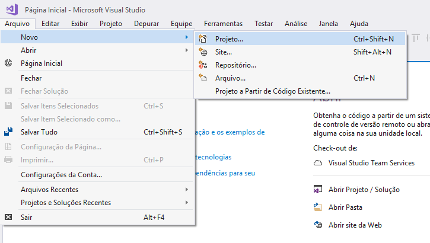
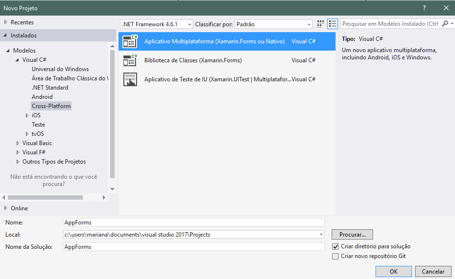
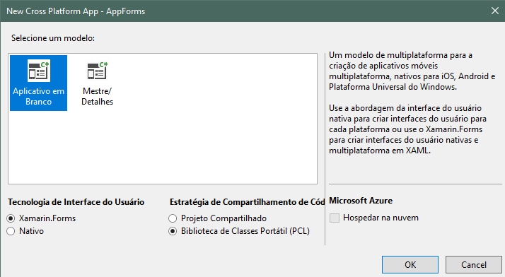

### Histórico de Revisões

| Data       |  Descrição                                | Autor                          |
|:----------:|:-----------------------------------------:|:------------------------------:|
| 07/05/2017 | Introdução e Guia de Instalação           | Felipe Hargreaves (15/0009313) |
| 30/05/2017 | Arquitetura MVVM                          | Felipe Hargreaves (15/0009313) |
| 30/05/2017 | Arquivos ignorados                        | Clarissa Borges (15/0007973)   |
| 30/05/2017 | Atualização do projeto local com o remoto | Clarissa Borges (15/0007973)   |
| 30/05/2017 | Criando um Projeto Xamarin.Forms | Mariana Pícolo (15/0017502)   |

----

[Introdução](#introdução)  
[Configuração de Ambiente](#configuração-de-ambiente)  
[Arquitetura MVVM](#arquitetura-mvvm)  
[Criação de um projeto Xamarin.Forms](#criação-de-um-projeto-Xamarin.Forms)  
[Atualização do projeto local com o remoto](#atualização-do-projeto-local-com-o-remoto)  
[Testes unitários](#testes-unitários)  
[Testes de aceitação](#testes-de-aceitação)  
[Links úteis](#links-úteis)   

---

# Introdução

 <b>Xamarin</b> é uma plataforma para desenvolvimento multi-plataforma de aplicações <i>mobile</i> mantida pela <i>Microsoft</i>. Através de uma base de código compartilhado em <i>C#</i>, é possível criar aplicativos com acesso à elementos nativos de interface e API tanto para <i>Android</i> quanto para <i>iOS</i>, proporcionando soluções de alto desempenho. 

# Configuração de Ambiente

 Atualmente, o <i>Xamarin</i> encontra-se disponível para os sistemas operacionais <i>Windows</i> e <i>macOS</i>, fazendo uso, respectivamente das IDEs <i>Visual Studio</i> e <i>Xamarin Studio</i>. O processo de instalação e configuração da ferramenta é apresentado a seguir:

**Windows 10:**

**Passo 1**: Instalar o Visual Studio com o Xamarin:  
**1)** Fazer o download do instalador do [Visual Studio Community 2017](https://www.visualstudio.com/) ou a versão estável mais recente.  
**2)** No instalador, selecionar a opção **Desenvolvimento móvel com .NET**, na seção *Celular & Jogos*.  
**3)** Aguardar o download dos componentes necessários e a instalação da plataforma. O Visual Studio já será instalado com todas as ferramentas necessárias referentes ao Xamarin.

**Passo 2**: Instalando e configurando o Git para Windows:  
**1)** Fazer o download do [Git](https://git-scm.com/downloads).  
**2)** Prosseguir com a instalação, utilizando as opções padrão.  
**3)** Junto com o Git, é instalado um emulador de terminal com uma versão básica do *bash*. Dessa forma é possível o uso do Git através de linha de comando, com os mesmos comandos utilizados em outros sistemas.  
**4)** Dentro do Git Bash, configurar o usuário com os seguintes comandos, trocando as informações entre aspas:

    git config --global user.name "Nome do usuário"

    git config --global user.email "Email do usuário"

# Arquitetura - MVVM

 O padrão arquitetural adotado no desenvolvimento de projetos em Xamarin é o <b>Model-View-ViewModel (MVVM)</b>, uma variação do MVC tradicional. Desenvolvida pela <i>Microsoft</i>, visa simplificar a programação em ambientes guiados a eventos, como é o caso de aplicações <i>mobile</i>. De forma geral, as atribuições de cada componente do MVVM são:

* 
<b>Model</b>: Representa o modelo de domínio da aplicação, com a definição de seus objetos e provendo uma camada de acesso aos dados. 
* 
<b>View</b>: Determina a estrutura dos elementos a serem exibidos na tela e a sua organização na mesma. É a camada que interage com o usuário.
* 
<b>View Model</b>: Disponibiliza para a View uma lógica de apresentação, ao mesmo tempo em que não possui conhecimento sobre nenhum aspecto específico da View. Possui propriedades e comandos que servem para "popular" a View com dados e notificá-la de mudanças de estado. A conexão entre as duas é realizada através de um processo denominado <i>Data Binding</i>. 

Alguns pontos importantes e dicas para o cumprimento dos padrões de arquitetura no desenvolvimento de uma aplicação Xamarin:

* 
 A ViewModel, em hipótese alguma, deve conter referências à View ou a elementos da mesma. Sua estruturação deve seguir a ideia de <i>POCO - Plain Old CLR Object</i>, isto é, não utilizar nenhum recurso ou dependência além dos componentes proporcionados pelo C#/.NET Framework. Além de diminuir o acoplamento entre as classes do sistema, isso torna a ViewModel uma estrutura 100% testável.
* 
 De forma similar, Models não devem conter referências a elementos tanto das Views quanto das ViewModels. Sua única atribuição é a modelagem e acesso aos dados do sistema.
* 
 Para manter a ideia de que a ViewModel não tem conhecimento sobre a View, elementos de navegação entre páginas ou envio de pop-ups não devem ser implementados diretamente na ViewModel. Devem ser criadas interfaces contendo os métodos de navegação do Xamarin, e o acesso realizado a partir destas. Desta forma, a ViewModel mantém sua propriedade de <i>POCO</i> e continua sendo testável, sendo necessário apenas realizar o <i>Mock</i> das interfaces implementadas.
* 
 Cada View em Xamarin é composta por dois arquivos: um <i>.xaml</i>, que define os elementos de UI da página e um <i>.xaml.cs</i>, popularmente conhecido como <i>Code-Behind</i>, onde pode se instanciar a lógica da View e definir outros elementos. De forma geral, esses arquivos tem as mesmas capacidades - tudo que pode ser definido em XAML também pode ser escrito em C#. Na prática, entretanto, é recomendado que toda a declaração da interface seja feita através do XAML e que toda a lógica de apresentação seja delegada à ViewModel. Nessa situação, o <i>Code-Behind</i> se torna um arquivo praticamente vazio, contendo apenas a declaração do BindingContext daquela página. Em alguns casos não se pode alcançar esse cenário ideal, mas ainda assim deve se tentar manter o <i>Code-Behind</i> o mais "limpo" possível.
* 
 As ViewModels devem implementar e utilizar em suas propriedades a interface INotifyPropertyChanged. Como o nome sugere, ela é responsável por notificar mudanças de estado em propriedades. Dessa forma, pode-se manter a apresentação da View sincronizada com as mudanças de estado que ocorrem na Model determinadas pela ViewModel.

### Referências adicionais sobre MVVM:
[Xamarin Guides - From Data Binding to MVVM](https://developer.xamarin.com/guides/xamarin-forms/xaml/xaml-basics/data_bindings_to_mvvm/)

[Xamarin Developers - Introduction to Data Binding](https://blog.xamarin.com/introduction-to-data-binding/)

# Criação de um projeto Xamarin.Forms

1. 
Após a instalação da versão mais recente do Visual Studio, para criar um novo projeto execute: <b>Arquivo > Novo > Projeto</b>.

   

2. 
No painel esquerdo da janela Novo Projeto, selecione <b>Visual C# > Cross-Platform</b> para indicar que deseja criar um aplicativo para multi-plataforma. No painel central, selecione <b>Aplicativo Multiplataforma (Xamarin.Forms ou Nativo)</b>. Ainda no painel central, na parte inferior, dê nome e local ao novo projeto, e clique em <b>OK</b>.

3. 
 Selecione <b>Aplicativo em Branco</b>, a tecnologia de interface de usuário como <b>Xamarin.Forms</b>, e a estratégia de compartilhamento de código como <b>Biblioteca de Classes Portátil (PCL)</b>.

4. Aguarde a criação do projeto, ignorando qualquer instrução de conectar com o Mac.   

## Arquivos ignorados

 A construção de um projeto em <i>Xamarin</i> no <i>Visual Studio</i> resulta na geração automática de vários arquivos que não precisam e nem devem ser mandados no repositório. Para lidar com tais arquivos, um .gitignore é adicionado ao repositório, assim, tudo o que não deve mais ser monitorado é dispensado. O arquivo abaixo de .gitignore pode ser utilizado no projeto que deseja-se desenvolver:

[Git ignore](https://github.com/fga-gpp-mds/2017.1-Forum-Coordenadores-DEG/blob/master/.gitignore)

# Atualização do projeto local com o remoto

 Para a atualização do projeto local com o remoto, é necessário abrir o Git Bash na pasta do repositório e executar o seguinte comando:

    git pull --rebase [nome do remoto] [branch]

 É recomendado que isso seja feito apenas depois que um commit for criado para que não se corra riscos de perder alterações e para que, ao enviar o push force depois que não houver conflitos, não existam alterações que não sejam do rebase sem estarem atreladas a um commit.  

## Resolvendo conflitos

 É muito comum que, executando este comando, o Git Bash acuse conflitos. Para resolver os conflitos, fecha-se a solução no <i>Visual Studio</i>, mantendo apenas o programa aberto e se executa o comando no Git Bash:

    git status

 Os arquivos destacados em vermelho são os arquivos onde existem conflitos entre a branch do repositório local e a do repositório remoto. Em nome de uma maior praticidade, recomenda-se que os conflitos sejam resolvidos no próprio <i>Visual Studio</i>, mas é possível consertá-los em qualquer outro editor de texto. Para abrir o arquivo com conflito no <i>Visual Studio</i>, basta pressionar Ctrl + O no teclado e procurar um dos arquivos com conflitos no explorador.

 Aberto o arquivo, é hora de consertar as divergências. Normalmente, elas são indicadas por um <b>&lt;&lt;&lt;&lt;&lt;&lt;&lt;</b>, que mostra o início da parte conflitante do repositório remoto, um <b>=======</b>, onde termina o trecho em conflito do remoto e inicia-se a parte conflitante do repositório local e um <b>&gt;&gt;&gt;&gt;&gt;&gt;&gt;</b> onde termina o conflito. Cabe ao desenvolvedor analizar qual parte deverá ser mantida e qual parte deverá ser deletada. Os indicadores dos conflitos precisam ser apagados e o arquivo deverá ser salvo. É possível que haja mais de um conflito em apenas um arquivo.

 Resolvidos os conflitos no arquivo, é necessário dar um comando no Git Bash para adicionar o arquivo que já está pronto:

    git add [nome do arquivo]

 O procedimento de resolver conflitos nos arquivos deve ser repetido em todos os arquivos destacados em vermelho no Git Bash até que não haja mais nenhum. Depois que não houver mais nenhum arquivo indicado como modificado, é preciso dar continuidade a resolução dos conflitos usando:

    git rebase --continue

 Novamente, outros arquivos aparecerão destacados com conflitos e será necessário repetir os passos de abrir e editar cada arquivo até que o Git Bash não mostre mais que existem conflitos. Quando isso acontecer, é importante carregar a solução do projeto no <i>Visual Studio</i> e testar se a aplicação está funcionando como deveria. Para finalizar, basta mandar as alterações em um push force no Git Bash usando:

    git push -f [nome do remoto] [branch]

 É importante frisar que é preciso ter cuidado ao utilizar o comando do push force: o uso indevido do comando pode trazer problemas para o projeto. Vale ressaltar também que os comandos para a atualização do repositório local com o repositório remoto devem variar de acordo com a política de commits da equipe.

# Testes unitários

# Testes de aceitação

# Links Úteis

 <a href="https://developer.xamarin.com/guides/"> All Guides, Xamarin</a>